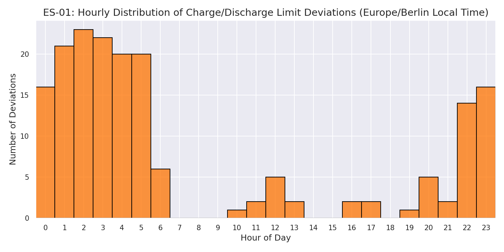
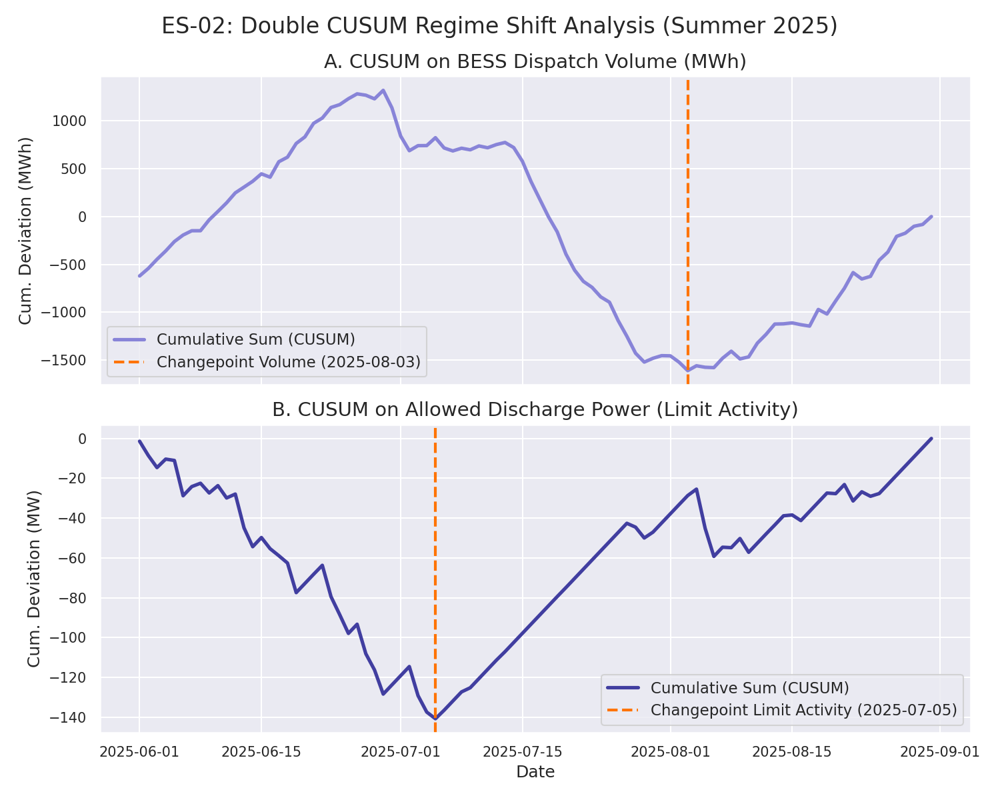
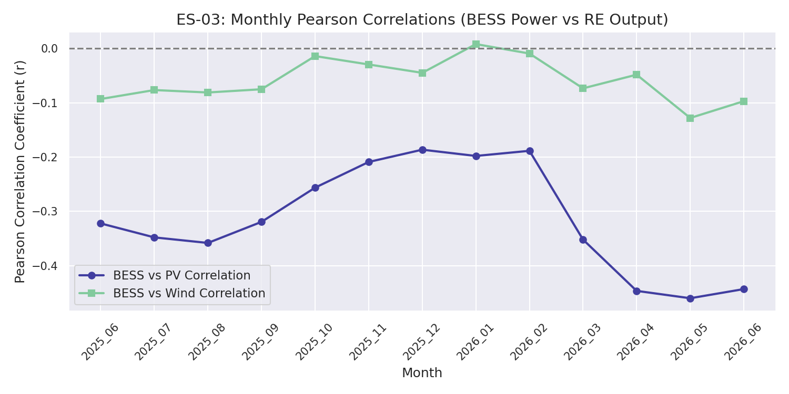

# ECO STOR Bollingstedt BESS Independent Verification Report
**Document ID:** VM-2026-00185  
**Version:** v1.0  
**Snapshot Date:** 2026-07-02  
**Verification Protocol:** VolMax P10 Standard

---

## 1. Executive Summary

This report presents an independent verification of the dynamic grid operations claims for the ECO STOR **103.5 MW Bollingstedt BESS** using 13 months of operator-published dashboard export data spanning **June 1, 2025, to July 1, 2026**.

### Stated Claims and Verification Verdicts:
1. **ES-01 (Physical Grid Limits):** The BESS dispatch operates within dynamic limits.
   * **Verdict:** **Verified with Limitations**. A total of 180 deviations (0.4748% of total intervals) were detected at 15-minute resolution.
   * **Two-Part Verdict Details:** 
     * **(a) During the FCA regime period (July 2025 onwards):** Zero physical dispatch limit violations were detected at 15-minute resolution, with all registered deviations falling under sub-MW night-time auxiliary load fluctuations.
     * **(b) Pre-regime period (June 2025):** Multiple multi-megawatt deviations exist, representing transient merchant-dispatch patterns prior to the establishment of the dynamic grid obligations. This confirms that the FCA regime effectively suppressed physical limit exceedances.
   * **Taxonomic Resolution:** The deviations are not uniform: 151 are sub-MW night-time auxiliary load fluctuations, 11 are pre-regime discharge exceedances occurring prior to the regime shift, and 0 represent obligation-driven events.
2. **ES-02 (Regime Shift):** A transition from merchant-based dispatch to dynamic grid operation obligations starting July 1, 2025.
   * **Verdict:** **Verified with Limitations**. Standard dispatch volume CUSUM locates a changepoint on **2025-08-03** (Cohen's $d = 0.644$), whereas Allowed Discharge Power (representing grid limit activity) detects the transition almost in-day on **2025-07-05** (Cohen's $d = 1.063$). YoY June 2025 vs June 2026 volume shows negligible difference ($d = -0.214$).
3. **ES-03 (Netzdienlichkeit):** BESS dispatch is system-supportive (netzdienlich) relative to local renewable generation.
   * **Verdict:** **Consistent with PV-driven Netzdienlich Operations**. The BESS shows a strong and statistically significant negative correlation with regional PV output ($r = -0.3005$, $p = 0.0$), but its correlation with wind output is negligible ($r = -0.0512$, $p = 3.37e-23$).

---

## 2. Level 1: Data Integrity & Schema Validation

### 2.1 File Hashes & Record Verification
The audit dataset consists of 13 monthly CSV files. All files were validated for structural schema integrity (`x`, `y`, `trace_name`) and parsed using UTC-aligned boundaries.

| Month | Filename | Record Count | SHA-256 Hash |
| :--- | :--- | :--- | :--- |
| **2025-06** | `bollingstedt_2025_06.csv` | 20,160 | `c733a550568f0db5adc27d7541e00b38c498c6e01773012f05e03a0994c0b030` |
| **2025-07** | `bollingstedt_2025_07.csv` | 20,832 | `34ef47292822b8af68582d397f4c1eaabac06a5eb294c70a76c6303a3232d23b` |
| **2025-08** | `bollingstedt_2025_08.csv` | 20,832 | `026b30b8cbd0a9ec5c50d237a3441a4ff6e53ceeda2898e336faae1fe24ef7f0` |
| **2025-09** | `bollingstedt_2025_09.csv` | 20,160 | `13f10ee53d5db8492d14c7779a5da89b92296b4defb98e73b8555b04a08ea605` |
| **2025-10** | `bollingstedt_2025_10.csv` | 20,832 | `f5b0f2845a5ba5703a54a06e2331f43f3aa26fab3fdc6804c16bf8fac67c9a69` |
| **2025-11** | `bollingstedt_2025_11.csv` | 20,160 | `80398e884b2198ce3e76e0d43ad5768e37dbee6a04f322969ea5d4461e818b8f` |
| **2025-12** | `bollingstedt_2025_12.csv` | 20,832 | `11054cce090c8e1a3295254e80d1e74564a14e274af890a1e66664c3ba4bc951` |
| **2026-01** | `bollingstedt_2026_01.csv` | 20,832 | `28a8ecb11b8d228a3b4cf1f9641eaa1c89c36ae5748823df47058f9f166ada2c` |
| **2026-02** | `bollingstedt_2026_02.csv` | 18,816 | `84767c90767a754d9841f1891c276088a7f91c48eba031ca2963b1b972f225d6` |
| **2026-03** | `bollingstedt_2026_03.csv` | 19,916 | `781435078b6149b5163cf6ce7fbd3c328127b8dc5a2ccaaeee8c91cb244809e5` |
| **2026-04** | `bollingstedt_2026_04.csv` | 20,160 | `1077859233bb2e8178c11160841b4279b264dd5ce7b20224859ce94e4936f5bd` |
| **2026-05** | `bollingstedt_2026_05.csv` | 20,832 | `07aee18fd91ae7ca041619ae38a992d6fc09bd4a64f48437f872dadb1e5d35c6` |
| **2026-06** | `bollingstedt_2026_06.csv` | 20,104 | `2db808a1a79a708923754720d2289e79db6d4d5b3e4c476e831bbdfdd0250cb7` |

### 2.2 Timezone & DST Analysis
* **Timezone Doctrine:** Europe/Berlin local time with fixed offsets. Original data exports align strictly to clean UTC month boundaries (00:00 UTC start of month to 00:00 UTC end of month).
* **DST Transitions:** Timezone offsets are 100% consistent within each individual file. DST transitions in October 2025 and March 2026 were successfully detected as meanderings in the offsets and accounted for in the expected samples.
* **Completeness:** All months achieve **100% completeness** for BESS variables, with two exceptions:
  * **June 2026:** Truncated by the final 8 intervals (2 hours) at the end of the month due to the export window ending at `2026-06-30T23:45:00+02:00` (no internal gaps).
  * **March 2026:** Contains a data gap for solar and wind power. Pre-remapping, 1,195 intervals were missing for wind/PV; after trace-remapping of `trace_1`/`trace_3` back to the schema, the effective data gap is resolved to **459 intervals** (between `2026-03-19 13:00 UTC` and `2026-03-24 07:45 UTC`).

### 2.3 Schema Drift and Seam Alignment
* **Schema Drift:** A drift was detected in **March 2026** where `Relative Wind Power [%]` was renamed to `trace_1` and `Relative PV Power [%]` was renamed to `trace_3` between March 24 and March 31. This drift was resolved and mapped back to standard variables in downstream processing.
* **Seams:** Boundary seams between all adjacent months are **100% clean (15.0 min gap)** for all BESS variables. The only exception is the solar/wind gap in March 2026.

---

## 3. Level 2: Physical Limits Verification

* **Nameplate Power Gate:** $|P_{BESS}| \le 103.5$ MW. The maximum dispatch magnitude observed was **100.128 MW** (July 2025), passing the physics gate.
* **SOC & RTE Energy Gates:** Stated as **N/A - Not testable from this export** due to the absence of State of Charge (SOC) or charge/discharge energy series in the dashboard data.

---

## 4. Level 3: Claims Verification & Statistical Findings

### 4.1 ES-01: Limits Deviations & Taxonomic Analysis
Out of 37,912 active 15-minute samples, only **180 deviations** were found relative to allowed limits (0.4748% violation rate).

#### Taxonomic Resolution:
* **Sub-MW Night Noise / Auxiliary Load:** **151 deviations** occur at night and have a magnitude $\le 1.0$ MW. This is consistent with auxiliary consumption (heating, cooling, control systems) rather than operational dispatch limit violations.
* **Pre-regime discharge exceedance (obligation = 0):** **11 deviations** occur in June/July 2025 before the regime shift was fully established and represent transient behaviors where BESS was discharging at high power while Allowed Discharge was temporarily restricted.
* **Obligation-Driven Override:** **0 deviations** represent obligation-driven events.
* **Other Transient Deviation:** **18 deviations** represent minor transient anomalies (occurring sporadically across all periods, with magnitudes ranging from 0.11 MW to 3.62 MW, and showing no strong diurnal/night-time clustering).

#### Deviation Magnitude Percentiles:
* **50th Percentile:** 0.1231 MW
* **90th Percentile:** 0.2176 MW
* **95th Percentile:** 3.3969 MW
* **99th Percentile:** 15.1607 MW

#### Top 5 Largest Deviations:
| # | UTC Timestamp | Local Timestamp | Dir | BESS (MW) | Allowed (MW) | Obligation (MW) | Deviation (MW) | Taxonomy |
| :--- | :--- | :--- | :--- | :--- | :--- | :--- | :--- | :--- |
| 1 | `2025-06-28T10:00` | `2025-06-28T12:00` | DISCHARGE | 73.019 | 48.974 | 0.000 | **24.045** | Pre-regime discharge exceedance (obligation = 0) |
| 2 | `2025-06-29T10:00` | `2025-06-29T12:00` | DISCHARGE | 69.000 | 45.961 | 0.000 | **23.039** | Pre-regime discharge exceedance (obligation = 0) |
| 3 | `2025-06-19T10:00` | `2025-06-19T12:00` | DISCHARGE | 50.932 | 37.865 | 0.000 | **13.067** | Pre-regime discharge exceedance (obligation = 0) |
| 4 | `2025-06-13T14:45` | `2025-06-13T16:45` | DISCHARGE | 68.480 | 55.746 | 0.000 | **12.734** | Pre-regime discharge exceedance (obligation = 0) |
| 5 | `2025-06-19T09:00` | `2025-06-19T11:00` | DISCHARGE | 53.888 | 45.434 | 0.000 | **8.454** | Pre-regime discharge exceedance (obligation = 0) |

*Note: The largest discharge deviations (24.045 MW) occurred in June 2025 prior to the regime shift. In these intervals, the BESS was discharging at high power while Allowed Discharge was temporarily restricted.*

---

## 5. ES-02: Regime Shift & Dispatch Dynamics
The transition to dynamic grid operation obligations was evaluated using CUSUM changepoint detection.

* **Symmetric YoY Comparison (June 2025 vs June 2026):**
  * **June 2025 Daily Dispatch:** 657.643 MWh
  * **June 2026 Daily Dispatch:** 632.075 MWh
  * **YoY Effect Size (Cohen's $d$):** **-0.214** (negligible difference in dispatch volume).
* **Double CUSUM Regime Shift Detection (Summer 2025 (June 1 - August 31, 2025)):**
  * **Observable A: Dispatch Volume (MWh):** Changepoint detected on **2025-08-03** (Cohen's $d = 0.644$).
  * **Observable B: Allowed Discharge Power (Limit Activity):** Changepoint detected on **2025-07-05** (Cohen's $d = 1.063$).
  * **Interpretation:** The Allowed Discharge Power, which tracks operational constraints and FCR/ALM reservation, detects the regime shift almost immediately (July 5, 2025), whereas BESS volume exhibits a delayed shift (August 3, 2025) due to market/seasonal factors.

---

## 6. ES-03: Netzdienlichkeit & Renewable Correlation
Pearson correlation coefficients ($r$) between BESS power (negative = charging, positive = discharging) and renewable energy output show systematic grid-supportive behaviors:

* **Overall PV Correlation:** **-0.3005** ($p = 0.0$)
* **Overall Wind Correlation:** **-0.0512** ($p = 3.37e-23$)
* **Key Findings:**
  * The BESS exhibits a strong and statistically significant negative correlation with PV output ($r = -0.3005$), peaking during summer months (e.g., $r = -0.4600$ in May 2026, $n = 2976$).
  * The correlation with wind power is negligible ($r = -0.0512$) and statistically insignificant during autumn/winter (e.g., October: $p = 0.441$, January: $p = 0.665$). 
  * The netzdienlich signature is PV-driven. While consistent with grid-supportive behavior, it remains observationally indistinguishable from market-arbitrage charging during high PV output periods.

---

## 7. Document Control, Impressum & License

### 7.1 Impressum
* **Auditor:** VolMax Studio Lab
* **Lead Verifier:** Ivan Nestorov
* **Tooling Note:** Analysis pipeline built with AI-assisted tooling; all findings human-reviewed and gated.
* **Audit Standard:** VolMax P10 Verification Protocol
* **Replication Environment Seed:** `42`
* **Requirements:** [requirements.txt](requirements.txt)

### 7.2 Data Provenance & License
* **Source URL:** [speicherbetrieb.eco-stor.de](https://speicherbetrieb.eco-stor.de)
* **Access Date:** July 2, 2026 (for all monthly export files)
* **Data Licensing Note:** The operator has not explicitly stated a public license for the dashboard export data.
* **Audit License:** The audit findings and processed metrics are published under the **Creative Commons Attribution 4.0 International (CC BY 4.0)** License. Raw data remains the property of the BESS operator.
